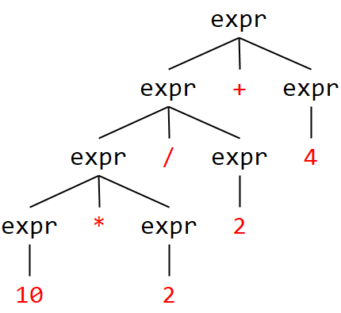

# Syntaxerkenner mit ANTLR

## Aufgabe 1

### a)

Die Grammatik ist vom Chomsky-Typ **Typ 2 (kontextfrei)**.

### b)

Die Grammatik ist **eindeutig**.

### c)

`expr --> term | expr + term | expr - term` ist **linksrekursiv**.

`term --> fact | term * fact | term / fact` ist **linksrekursiv**. 

`fact --> int | (expr)` ist nicht rekursiv.

### d)

`+, -` Prioritätsebene 1, linksassoziativ

`*, /` Prioritätsebene 2, linksassoziativ

`int, (expr)` Prioritätsebene 3

### e)

### f) und g)

Siehe Code.

## Aufgabe 2

### a)

Die Grammatik ist vom Chomsky-Typ **Typ 2 (kontextfrei)**.

### b)

Die Grammatik ist **eindeutig**.

### c)

`prog --> stat | stat prog` ist **iterativ**.

`stat --> expr NL | NL` ist nicht rekursiv.

`expr --> term | term + term | term - term` ist **iterativ**.

`term --> fact | fact * fact | fact / fact` ist **rechtsrekursiv**.

`fact --> + fact | - fact | (expr) | INT` ist **rechtsrekursiv**.

### d)

`+, -` Prioritätsebene 1, linksassoziativ

`*, /` Prioritätsebene 2, linksassoziativ

### e)

### f) und g)

Siehe Code.

## Aufgabe 3)

### a)

Die Grammatik ist vom Chomsky-Typ **Typ 2 (kontextfrei)**.

### b)

Die Grammatik ist **nicht** eindeutig.

### c)

`expr --> int` ist nicht rekursiv.

`expr --> expr + expr` ist **links- und rechtsrekursiv**.

`expr --> expr - expr` ist **links- und rechtsrekursiv**.

`expr --> expr * expr` ist **links- und rechtsrekursiv**.

`expr --> expr / expr` ist **links- und rechtsrekursiv**.

`expr --> (expr)` ist nicht rekursiv.

### d)

Dies ist nicht entscheidbar.

### e)

Ein möglicher Syntaxbaum:

### f), g) und h)

Siehe Code.
